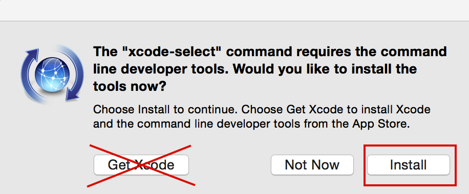
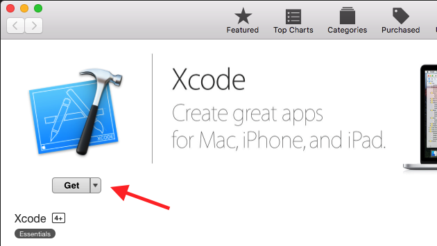
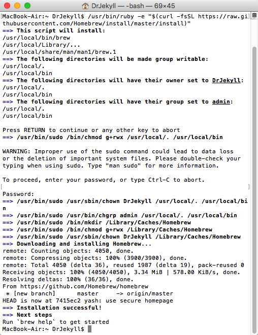

## What are all these terms (static site, Jekyll, GitHub Pages) & why might I care?

> **This lesson is for you if** you'd like a free (including web hosting!), easy-to-maintain, secure website such as a scholarly blog, project website, or online portfolio. You'll need to be a Mac user. At the end of this lesson, you'll have a live website where you can publish content that other people can visit.
[static site

databases: security, maintenance, speed, archivability

static site generator, Jekyll

GitHub, git

GitHub Pages

This tutorial is built on the official Jekyll Documentation written by the Jekyll community. See the "Read more" section below if you'd like to know even more about these terms.]

*Operating systems*: This tutorial is aimed at Mac users only. Jekyll can also work for Linux (this tutorial uses the Mac/Windows GitHub Desktop software for simplicity, but Linux users will need to use git over the command line instead). Jekyll doesn't officially support Windows, but [offers instructions on getting it to work on Windows anyway](http://jekyllrb.com/docs/windows/#installation).

## Preparing for installation

*We'll set a few things up before installing the actual code that will run your website. If you already have any of the following set up on your computer, you can skip that subsection.*

### GitHub user account

*A GitHub user account will let you host your website on GitHub as well as keep track of versions of the website and its writing as it grows or changes over time.*

1. Visit [GitHub.com](https://github.com/) and click on the "Sign up" button on the upper right. Write your desired username; this will be visible to others, identify you on GitHub, and also be part of your site's URL (e.g. http://amandavisconti.github.io or http://amandavisconti.github.io/JekyllDemo; note you can also purchase your own domain name and use it for this site, but that won't be covered in this tutorial). Also write your desired email address and password, then click "Create an account".
2. On the next page, click the "Choose" button next to the "Free" plan option, ignore the "Help me set up an organization next" checkbox, and click "Finish sign up". 
3. *Optional*: Visit https://github.com/settings/profile to add a full name (can be your real name, GitHub user name, or something else) and other profile information, if desired.

### GitHub Desktop app

1. Visit the [GitHub Desktop site](https://desktop.github.com/) and click on the "Download GitHub Desktop" button to download the GitHub Desktop software to your computer (Mac and Windows only; Linux users will need to use git just via the command line, which is not covered in this version of the tutorial).
2. Once the file has completely downloaded, double-click on it and follow the directions to install GitHub Desktop as follows.
3. Enter the username and password for the GitHub.com account you created using the steps above. (Ignore the "Add an Enterprise Account" button.) Click "Continue".
4. Enter the name and email address you want the work on your site to be associated with (probably just your real name and normal email address, but it's up to you!). 
5. On the same page, click the "Install Command Line Tools" button and enter your computer's username and password if prompted (then click the "Install Helper" button on the prompt). After you get a popup message that all command line tools have successful installed, click continue.
6. The last page will ask "Which repositories would you like to use?". Ignore this for now and click the "Done" button. 
7. *Optional:* Follow the walkthrough of the GitHub Desktop app that will appear (this isn't necessary; we will cover anything you need to do with it in this lesson).

### Text editor

You'll need to download and install a "text editor" program on your computer, for making small customizations to your Jekyll site's code. Good free options include [TextWrangler](http://www.barebones.com/products/textwrangler/download.html) (Mac) or [Notepad++](https://notepad-plus-plus.org/) (Windows). Software aimed at word processing, like Microsoft Word or Word Pad, isn't a good choice because it's easy to forget how to format and save the file, accidentally adding in extra formatting and characters that will break your site. You'll want something that specifically can save what you write as plaintext (e.g. HTML, Markdown).

*Optional:* See "Authoring in Markdown" in the "Testing and drafting locally" section below for notes on a Markdown-specific editing program, which you may also wish to install when you get to the point of authoring webpages and/or blog posts.

### Command line

The command line is a way to interact with your computer using text: it lets you type in commands from simpler things such as "show me a list of the files in this directory" or "change who is allowed to access this file", to more complex commands. Where the command line uses text commands, a "graphical user interface" (aka GUI) is what you probably normally use to work with you computer: anything where commands are given through a visual interface containing icons, images, mouse-clicking, etc. Often it's simpler to type in (or cut and paste from a tutorial) a series of commands via the command line, than to do something using a GUI; sometimes there are things you'll want to do for which no one has yet created a GUI, and you'll need to do them via the command line. 

The default command line program is called "Terminal" on Macs (located in Applications > Utilities), and "Command Prompt" on Windows. Below is what a command line window looks like on the author's Mac (using Terminal). You'll see something like the "Macbook-Air:~ DrJekyll$" below; that text is called the "prompt" (it's prompting you to input commands). In the image, "Macbook-Air" is the name of my computer, and DrJekyll is the user account currently logged in—the prompt will use different names for your computer.

 

When asked to open a command line window and enter the code shown in gray boxes in this lesson, keep the following in mind:

1. **Each gray boxful of code should be treated as a separate command and thus handled separately:** copy all the text in a gray box, paste it into the command line, and press enter, before doing the same for any subsequent boxfuls (e.g. for the "Installation" section immediately below, first copy/paste/press enter for `xcode-select –install`, and only then do the same thing for the boxful starting with `ruby…` and so on).
2. **Let installation processes run before entering new commands.** Sometimes typing a command and pressing enter produces an instantaneous result; sometimes lots of text will start to fill up the command line window, or the command line window will seem to not be doing anything (but something is actually happening behind the scenes, like a file being downloaded). **When you've typed a command and hit enter, you'll need to wait for that command to completely finish before typing *anything else***, or you might stop a process in the middle, causing problems. You'll know your command is done when the command line spits out the prompt again (e.g. Macbook-Air:~ DrJekyll$ on the author's computer). See the screenshot under the "Homebrew" subsection of "Installing dependencies" below for an example of a command, followed by some text showing you what was happening while that command was processed, and finally the reappearance of the command prompt to let you know it's okay to type something else.

## Installing dependencies

We'll start by installing some software dependencies (i.e. code Jekyll *depends* on to be able to work) using the command line. Open a command line window and enter the code shown in the boxes below, keeping the command line tips in the last section in mind.

### Xcode

*Homebrew lets you download and install open-source software on Macs from the command line (it's a "package manager"), which will make installing Ruby (the language Jekyll is built on) easy—but you'll need to first install the Mac developer toolkit called Xcode to be able to use Homebrew.*

`xcode-select --install`

 

This will lead to a popup:

 

Click the "Get Xcode" button (*not* the "Install" button, which won't install both things you need). This will open the App Store, where you should click on the "Get" button, then the "Install App" button that will appear where you just clicked, and enter your Apple username and password when prompted. The button's text will change a third time to say "Installing".



Installation might take multiple hours (the file size is around 4.5 GBs); you can check the download status by clicking on the "Purchased" icon in the App Store menu and finding Xcode on that page. 

Once the software has completely downloaded, double-click on Applications > Xcode. You'll see a popup titled "Xcode and iOS SDK License Agreement" that you should agree to; provide your computer password if prompted. You'll then see a popup with a progress bar titled "Installing components"; wait for this to complete and for a new screen titled "Welcome to Xcode" to appear. You can now quit the Xcode program.

### Homebrew

After Xcode has completed installation, return to your command line window and enter the following:

``` 
/usr/bin/ruby -e "$(curl -fsSL https://raw.githubusercontent.com/Homebrew/install/master/install)"
```

You'll need to press enter when prompted and enter your computer password when asked. For reference, below is a screenshot of the command entered into the author's command line, followed by all the text that appeared (including the prompt to press RETURN and enter my password).



### Ruby & Ruby Gems

*Jekyll is built from the Ruby coding language. Ruby Gems makes setting up Ruby software like Jekyll easy (it's a package manager, just like Homebrew—instead of making installation easy on Macs, it adds some stuff to make Ruby installations simpler).*

`brew install ruby` (Don't forget to wait until the command prompt appears again to type the following command! If you're confused, see the "Preparing for Installation" section's "Command Line" #2, above.)

`gem install rubygems-update`

### NodeJS

*NodeJS (or Node.js) is a development platform (in particular, a "runtime environment") that does things like making Javascript run faster.*

`brew install node`

### Jekyll

*Jekyll is the code that handles doing the things you might want your website to do, such as using the same template (logo, menu, author information…) on all blog post pages.*

`gem install jekyll`

## Setting up Jekyll

*We'll now create a folder full of the files needed to run your website, locating them in a place accessible to the GitHub for Desktop app so they're ready when we want to publish them as a public website.*

1. You'll need to know the file path to the GitHub folder created by installing the GitHub for Desktop app (this is some text that says where a specific folder or file is within the directory tree on your computer; e.g. /Desktop/MyRecipes/Spaghetti.doc). If you don't know the GitHub folder file path, click on the magnifying glass icon in the top right of your computer screen.

   [screenshot 4]

   A search box will appear in the middle of the screen; type in "GitHub", then double-click on the "GitHub" option that appears under "Folders" to reveal the GitHub folder in Finder.

   [screenshot 5]

   Right-click on the "GitHub" folder and choose "Copy 'GitHub'". The GitHub folder file path is now copied.

2. At the command line, you're going to write `cd`, followed by a space, followed by the file path to your GitHub folder (either type it in if known, or press Command-v to paste in the file path you copied in Step 1). On the author's computer (logged in as the user DrJekyll) this command looks like:

   [screenshot 6]

   The "cd" command tells your computer to look at the place in the computer's folder system you specify by the path typed after it—in this case, the path to the GitHub folder created by installing the GitHub for Desktop app.

3. At the command line, type in the following—but replace "JekyllDemo" with whatever you want your site to be called. Note that your site's public URL will take the form http://amandavisconti.github.io/JekyllDemo, with *amandavisconti* being the author's GitHub username and *JekyllDemo* the name of the site I entered at this step (an option to purchase and use your own custom URL is possible; see the "Getting fancy" section below).

   `jekyll new JekyllDemo`

   This command told *jekyll* to create a *new* site by installing all the necessary files in a folder named *JekyllDemo*.

4. At the command line, type in the following to navigate into your site folder (through the rest of this lesson, always replace "JekyllDemo" with whatever name you chose for your site in Step 3):

   `cd JekyllDemo`

   [screenshot 7]

   If you look in the GitHub > JekyllDemo folder in Finder, you'll see that a bunch of new files—the files that will run your website!—have been installed:

   [screenshot 8]

5. ​

6. ​

   ​


[_config.yml]

## Testing and drafting locally

#### Authoring in Markdown

Markdown is a way of formatting documents. For Jekyll in particular, Markdown means you can write webpages and blog posts in a way that's comfortable to authors (e.g. no need to look up/add in HTML tags while trying to write an essay), but have that writing show up formatted nicely on the web (i.e. a text-to-HTML convertor).

There's a handy markdown [reference](http://kramdown.gettalong.org/quickref.html), as well as [a Programming Historian lesson on the hows and whys of writing with Markdown](http://programminghistorian.org/lessons/getting-started-with-markdown). You might be interested in "markdown editor" software such as [Typora](http://www.typora.io/) (OS X and Windows; free during current beta period), which will let you use popular keyboard shortcuts to write Markdown (e.g. highlight text and press command-B to make it bold) and/or type in Markdown but have it show as it will look on the web (see headings styled like headings, instead of like normal text with a # in front of them).

Make sure any Markdown cheatsheets you look at are for the "[kramdown](http://kramdown.gettalong.org/quickref.html)" flavor of Markdown, which is what GitHub Page (where we'll be hosting our website) supports. There are [various "flavors" of Markdown](https://github.com/jgm/CommonMark/wiki/Markdown-Flavors) that have subtle differences in what various symbols do, but for the most part frequently used symbols like those that create heading formatting are the same (so you're actually probably okay using a markdown cheatsheet that doesn't specify it's kramdown, but if you're getting errors on your site using symbols that aren't included in kramdown might be why).

Save as filename.md

### Templates

Header material, link to example blog post file on GitHub?

Posts

Pages

default.html for basics that stay across site (e.g. logo, main menu, footer material)

### Testing locally

See what your site looks like

## Hosting on GitHub Pages

1. Open the GitHub for Desktop app. Click the + icon in the top left corner, and click on the "Create" option along the top of the box that appears (if "Create" isn't already selected").

2. Fill in the "Name" field with what you'd like to call the site. 

3. The "Local Path" field will automatically populate with a possible place to store your site's files, but you can change this if desired by typing in something else, or using the "Choose…" button to navigate to the folder where you'd like to store the site on your computer.

4. Click "Create Repository" when done. You'll now see the name of your new repository (aka directory/folder of files running your website) in the left sidebar

   [screenshot 5]

5. Back to the command line! 

6. cd /Users/DrJekyll/GitHub/JekyllDemo

   You'll need to enter the directory path to your site repository, which was created in Step 3 of this section. If you don't remember it, just right-click on the name of the repository in the left sidebar of the GitHub for Desktop app, then choose "Open in Finder" in the dropdown to locate the folder; right-click .

Tip: you'll be accessing various files in your repository… [drag to Finder left sidebar for quick access]

["If your site uses only the `gh-pages` branch, set the `gh-pages` branch to your default branch and delete the `master` branch. This will ensure that when users visit your site’s repository, they see your site’s content, and that you don’t accidentally commit to the `master` branch, allowing the two to get out of sync. It will also set the default target for pull requests, ensuring contributors can’t do the same."]

## Getting fancy

Themes

- Ed (https://elotroalex.github.io/ed/, https://elotroalex.github.io/ed/documentation.html)
- Digital Edition theme (https://github.com/emory-libraries-ecds/digitaledition-jekylltheme)

Plugins (allowed by GitHub Pages)

What plugins GitHub Pages supports

Option to self-host and use any plugins

Your own domain name (e.g. the author's literaturegeek.com blog is built with Jekyll and hosted on GitHub Pages just like in this lesson, but uses a custom domain name I purchased and configured to point to my site)

http://prose.io

Migrate an existing blog

## Cheatsheet

- To draft posts locally
- To test stuff (new plugin, theme) locally
- To post to your live site

Not answered here? Found something that should be written more clearly? (Hypothesis link, GitHub fork link)

## Read more

Thanks to Tod Robbins and Matthew Lincoln for suggestions, and to the following:

* [Official Jekyll Documentation](http://jekyllrb.com/docs/home/)
* https://help.github.com/articles/using-jekyll-with-pages/
* Amanda Visconti, ["Introducing Static Sites for Digital Humanities Projects (why & what are Jekyll, GitHub, etc.?)"](http://literaturegeek.com/2015-12-08-WhyJekyllGitHub/)
* Alex Gil ["How (and Why) to Generate a Static Website Using Jekyll, Part 1"](http://chronicle.com/blogs/profhacker/jekyll1/60913)
* Eduardo Bouças ["An Introduction to Static Site Generators"](https://davidwalsh.name/introduction-static-site-generators)
* Markdown cheatsheet
* Jekyll themes
* Jekyll plugins
* http://ben.balter.com/jekyll-style-guide/