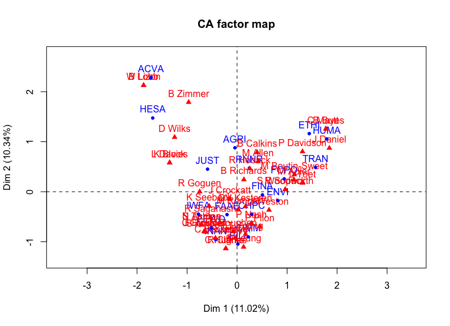
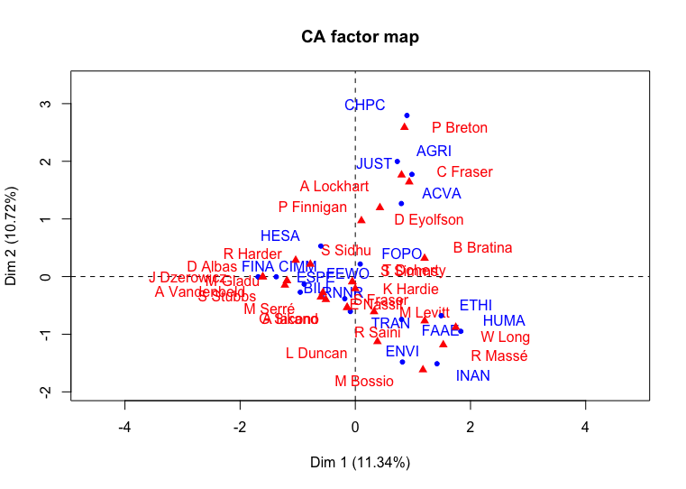
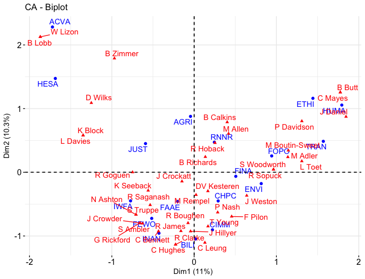
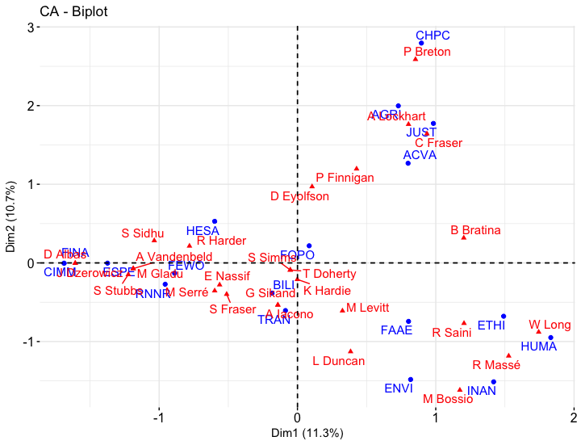
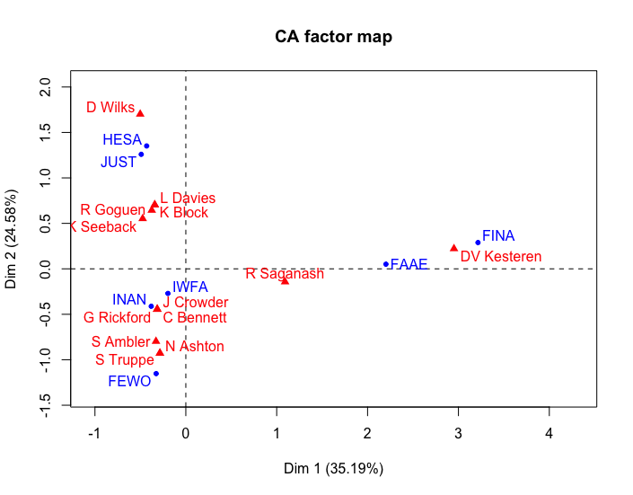
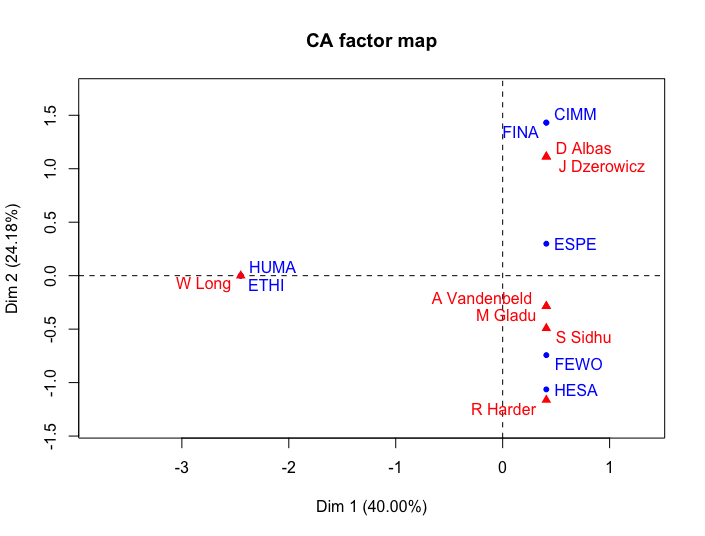
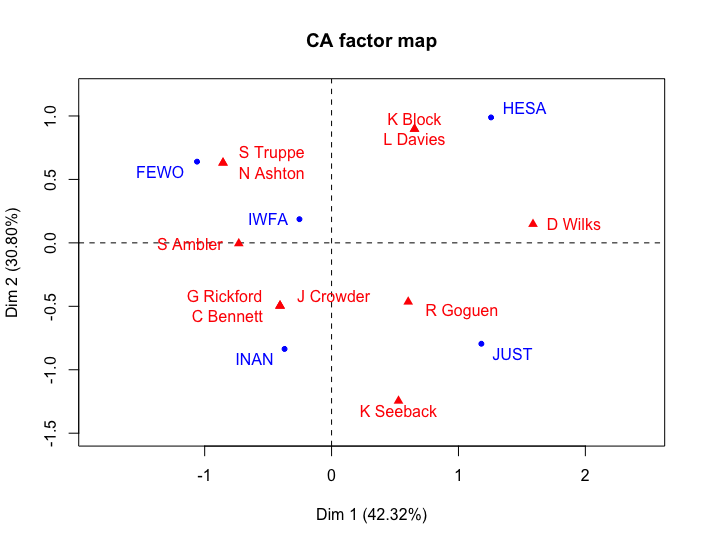

Sometimes you have no clue what happened during a historical event or why it happened. You just have a lot of data and two groups of things in that data -- "members" and "clubs," "words" and "books" or "countries" and "trade agreements" -- are inter-related in some way. You would like to have a two dimensional plot to show the significance of these relationships in some non-confusing manner. 

Correspondence analysis (CA) produces a two or three dimensional plot based on relationships among two or more categories of data. Unlike other plots where variables are specified on different axes, in correspondence analysis, the axes form organically from the relationships found in the available data. It is therefore quite similar to factor analysis and other forms of exploratory data analysis. The advantage to CA is that it shows relationships among the categorical information graphically.

In R, you can plot a graph that shows these relationships in action. Once seen, you can research the most important relationships in more detail. Thus, it can be a good first step to filter through the main themes of a large data.  It is therefore a powerful tool to understand historical information inside huge digital collections.

After reading this tutorial, you should:

* Know what correspondence analysis is and what it is used for.
* Know how to run correspondence analysis using R's FactoMineR library.
* Accurately describe the results of a correspondence analysis.

## Pre-requisites

This tutorial is for intermediate to advanced programming historians. It assumes you have basic understanding of R and some statistical knowledge (an understanding of chi squared tests (especially Pearson) would be especially helpful).

Taryn Dewar's tutorial on [R Basics with Tabular Data](http://programminghistorian.org/lessons/r-basics-with-tabular-data) has information on how to set up and configure R. Taylor Arnold and Lauren Tilton's tutorial on [Basic Text Processing in R](http://programminghistorian.org/lessons/basic-text-processing-in-r) could be helpful as a warm-up, also.  

 Since CA is a kind of social network analysis, it would not hurt to look at Marten Düring's [From Hermeneutics to Data to Networks: Data Extraction and Network Visualization of Historical Sources](http://programminghistorian.org/lessons/creating-network-diagrams-from-historical-sources) which also has some useful information on structuring data for network analysis. 

## What is Correspondence Analysis?

Correspondence analysis (CA), also called "multi-dimensional scaling" or "bivariate network analysis" lets you observe the inter-relationship of two groups in a two-way graph plot. For example, it was famously used by French sociologist Pierre Bourdieu to show how social categories like occupation influence political opinion.[^leroux] It is especially powerful as a tool for finding patterns in large datasets.

CA works on any kind of categorical data (datasets that have been grouped into categories). For example, if you wanted to understand the role that international free trade agreements had on the interconnection of particular nations, you could create a table for countries and the free trade relationships they held at a particular time. You might ask whether geographic proximity plays the most important reason countries engage in such agreements and if that's the case, the countries should a) align themselves from east to west and north to south and/or cluster by continent. On the other hand, maybe cultural factors like language, race or ethnicity play important roles as well? By mapping the countries with their agreements, you may encounter clues about whether this is the case. In general, a CA will plot the two most important factors.

Survey work can be visualized in a CA.  For instance, you could group historians according to eras (Medieval, Renaissance, Enlightenment, Victorian, World Wars etc.) and ask them particular questions about the field of historical research ("Oral traditions provide invaluable evidence for historical work", "It is essential to include quantitative data as an evidence base" etc).  The results might provide interesting insights into the ways the different historians conduct research and which historians have the most in common and why.

Overall, a well-planned correspondence analysis will provide clues about why certain entities connect. Sometimes the connections are obvious, like geographic proximity for countries or points in time for events. In other cases, the interconnections can be surprising. For example, what if the survey found that Medieval and Internet historians have more in common than other groups? The questions that they answered in similar numbers might explain why. Other times, connections can be mundane or coincidental. For example, if we were to conduct a correspondence analysis of authors based on the words they prefer to use, we would expect them to cluster by language first, which would tell us little about the connection of their ideas.  In that case, one might consider using a common translation to focus on the commonality (or diversity) of ideas rather than just the word themselves. By seeing both groups on a 2-dimensional graph, rough conclusions can be drawn very quickly. Then, you can ask more detailed questions about why the clustering occurred and if any text sources can back up the conclusions. This approach is more structured than simply hitting the archives or Google and guessing about where to start and can help you avoid an accusation of cherry picking data in a review. 

Perhaps it is easier just to show a Correspondence Analysis first.  It looks like this:


In it, there are two groups of objects.  In blue text are FEWO, IWFA, HESA, JUST & INAN.  These are abbreviations for Parliamentary Committees (discussed in the next paragraph).  

The red group are Members of Parliament or MPs.  Committees closer together can be assumed to have more similar membership. For example, FEWO (Status of Women), INAN (Indigenous Peoples and Northern Affairs) and IWFA (Violence Against Indigenous Women) are in the same quadrant, suggesting that they have more MPs in common than they do with other groups. Entities that are further away from the origin have higher *inertia* meaning they have fewer connections than those closer to the centre.

## Canadian Parliamentary Committees

In the Canadian Parliamentary system, citizens elect representatives called Members of Parliament or MPs to the House of Commons, where they are responsible for voting on and proposing changes to legislation in Canada. [Parliamentary Committees (CPCs)](http://www.ourcommons.ca/Committees/en/Home) consist of MPs who inform the House about important details of policy in a topic area. Examples of such committees include the CPCs on Finance, Justice and Health.

We use abbreviations because the names of the parliamentary committees can get quite long, making them hard to read.  You can use this table will act as a reference guide for the abbreviations and their respective committee names:

|  Abbreviation |  Committee Name                                    | 
|:------------------|:-----------------------------------------------------:|
| INAN | Indigenous and Northern Affairs | 
| HUMA  | Human Resources, Skills and Social Development and the Status of Persons with Disabilities |
| FINA | Finance | 
| FAAE | Foreign Affairs and International Development |
| ETHI |  Access to Information, Privacy and Ethics |
| ENVI | Environment and Sustainable Development |
| CHPC | Canadian Heritage |
| CIMM | Citizenship and Immigration | 
| ACVA | Veterans Affairs |
| HESA | Health |
| TRAN | Transport, Infrastructure and Communities | 
| FOPO | Fisheries and Oceans |
| RNNR | Natural Resources |
| FEWO | Status of Women |
| ESPE | Pay Equity | 
| IWFA | Violence against Indigenous Women |
| BILI | Library of Parliament | 
| AGRI | Agriculture and Agri-food | 
| JUST | Justice and Human Rights |

As a historian, I suspect that Members of Parliament are organized according to committee topics differently from government to government. For example, the committees formed during Stephen Harper's Conservative government's first cabinet must be differently organized than Justin Trudeau's Liberal initial cabinet. A number of reasons exist for this suspicion. First, CPCs are formed by party leadership and committee decisions need coordination amongs members of the House. In other words, political parties will use CPCs as tools to score political points, and governments must ensure the right people are members of the right committees to protect their political agendas. Second, the two governments have different political focus. Harper's Conservative government focussed more on issues of economic development, while Trudeau's Liberals first major decisions emphasized social equality. In short, there may be some calculated decisions about who goes into what committee, providing evidence about government attitudes towards or against certain topics. 

## The Data

The data for this tutorial can be found in a [git repository](https://github.com/greebie/Compare/blob/master/walkcompare/data/parl_comm_minority.json).  It has been conveniently included in tabular format as well:  1) [Harper's CPCs](../assets/correspondence-analysis-in-R/HarperCPC.csv) 2) [Trudeau's CPCs](../assets/correspondence-analysis-in-R/TrudeauCPC.csv). Here is a sample of the data for the first session of Stephen Harper's government:

Structured another way (through an R table) we can show that committees have many MPs and some MPs are members of multiple committees. For example, Liberal MP Carolyn Bennett was a member of "INAN" (Indigenous and Northern Affairs) and "IWFA" (Violence against Indigenous Women) and HESA (Parliamentary Committee on Health) included both D Wilks and K Block. In general, the committees have between nine and twelve members. Some MPs are members of only one committee while others may belong to multiple committees.

```
     C Bennett D Wilks DV Kesteren G Rickford J Crowder K Block K Seeback 
FAAE         0       0           1          0         0       0         0        
FEWO         0       0           0          0         0       0         0        
FINA         0       0           1          0         0       0         0        
HESA         0       1           0          0         0       1         0        
INAN         1       0           0          1         1       0         1        
IWFA         1       0           0          1         1       1         0        
JUST         0       1           0          0         0       0         1        

     L Davies N Ashton R Goguen R Saganash S Ambler S Truppe
FAAE        0        0        0          1        0        0
FEWO        0        1        0          0        1        1
FINA        0        0        0          0        0        0
HESA        1        0        0          0        0        0
INAN        0        0        0          0        1        0
IWFA        1        1        1          1        1        1
JUST        0        0        1          0        0        0
```

When we conduct a correspondence analysis of this table, we get the nice graph you saw above showing the committees and MPs in relation to each other.

Now that you have seen a correspondence analysis, it is time to show how to create and interpret the findings.


## Setting Up R for Correspondence Analysis

Since the file is in json, you will need a library to convert the raw json into something that R can use. We will also need a library that will conduct the correspondence analysis for us. In R, there are a number of options, but we will use the [FactoMineR library](http://factominer.free.fr/)[^factominer] a library focussed on "multivariate exploratory data analysis." In regular English that means "data that happened for a number of interesting reasons and we want to use statistics to find out why."

But first, here is how to install and call the libraries then pop them into an R object for wrangling.

```R

install.packages('curl') # for grabbing data a url
install.packages('FactoMineR') # includes a module for conducting CA
install.packages('factoextra') # library to prettify our CA graphs

# import the libraries:
library(FactoMineR)
library(factoextra)

# read the csv files

harper_df <- read.csv("http://programminghistorian.org/assets/correspondence-analysis-in-R/HarperCPC.csv")
```

## Correspondence Analysis of the Canadian Parliamentary Committees 2006 & 2016.

Our data frame consists of full committee names and MP names but some of the committee names (e.g., "Human Resources, Skills and Social Development and the Status of Persons with Disabilities") are too long to show well on a graph. Let's use the abbreviations instead.  We can extract these from the index of the dataframe, truncating the auto-numbering using the substr (substring) function.

```R
harper_table <- table(harper_df$abbr, harper_df$membership)
```

The 'table' command is magical.  It makes a cross-tabular dataset out of two categories in the data frame. The columns are individual MPs and rows are committees. Each cell contains a 0 or a 1 based on whether a connection exists. If we looked at actual attendence at each meeting we could also include weighted values (eg. 5 for attending a committee meeting 5 times).

Unfortunately, we have one more problem.  A large number of MPs are members of only 1 committee.  That will cause those MPs to overlap when we create the graph. Let's require MPs to belong to at least 2 committees instead, before we run FactoMineR's CA command.

```R
harper_table <- harper_table[,colSums(harper_table) > 1]
CA_harper <- CA(harper_table)
```

The CA command plots the results for the top two dimensions and stores the data summary in a variable called CA_harper. For the most part, the CA command does most of the work for us. More details about the mathematics behind CA are provided in the [^appendix at the bottom of this lesson].

You should get a graph that looks something like this:



Let's wrangle the Trudeau government data in the exact same way.

```R
trudeau_df <- read.csv("http://programminghistorian.org/assets/correspondence-analysis-in-R/TrudeauCPC.csv")
trudeau_table <- table(trudeau_df$abbr, trudeau_df$membership)
trudeau_table <- trudeau_table[,colSums(trudeau_table) > 1]
CA_trudeau <- CA(trudeau_table)
```


Oh dear. Our data labels are not very readable right now. Even with the switch to abbreviations, the labels are overlapping.  The [factoextra](https://cran.r-project.org/web/packages/factoextra/index.html) library has a special tool that lets us make labels repel each other to show things more clearly.

```
fviz_ca_biplot(CA_trudeau, repel=TRUE)
fviz_ca_biplot(CA_harper, repel=TRUE)
```





Instead of overlapping, the labels now use arrows to show their location where appropriate.

## Interpreting the Correspondence Analysis

The data plots look nicer, but how well can we trust the validity of this data?  Our first hint is to look at the dimensions.  In the Harper data, only eleven and ten percent explanatory value appear on the horizontal and vertical axis respectively for a total of 21 percent! That does not sound promising for our analysis. Remembering that the total number of dimensions is equal to the number of rows or columns (whichever is smaller), this could be concerning.  

Another way to look at the data is through inertia values for each data point and the for the graph as a whole.  More details about inertia can be provided in the appendix below, but the general idea can be gathered by observing the graph.  The further a data point ventures away from the origin of the graph, the greater the inertia value for that data point. High inertia points generally suggest outliers -- actors or events that lie outside the norm of the dataset. Low inertia values suggest data points that have more in common with the group as a whole. As an analysis tool, it can be useful for finding renegade actors or subgroups in the dataset. If all the points have high inertia, it could be an indicator of high diversity or fragmentation for the networks. Low overall inertia could be an indicator of greater cohesiveness or general convergence. What it means will depend on the dataset.

Let's look at the data more closely:

```R 

summary(CA_harper)
```
gives us

```
HARPER

The chi square of independence between the two variables is equal to 655.6636
(p-value =  0.7420958 ).

Eigenvalues
                       Dim.1   Dim.2   Dim.3   Dim.4   Dim.5   Dim.6
Variance               0.831   0.779   0.748   0.711   0.666   0.622
% of var.             11.024  10.342   9.922   9.440   8.839   8.252
Cumulative % of var.  11.024  21.366  31.288  40.729  49.568  57.820

                       Dim.7   Dim.8   Dim.9  Dim.10  Dim.11  Dim.12
Variance               0.541   0.498   0.463   0.346   0.305   0.263
% of var.              7.174   6.604   6.138   4.591   4.041   3.488
Cumulative % of var.  64.995  71.599  77.736  82.328  86.368  89.856

                      Dim.13  Dim.14  Dim.15  Dim.16  Dim.17
Variance               0.240   0.195   0.136   0.105   0.088
% of var.              3.180   2.591   1.807   1.396   1.170
Cumulative % of var.  93.036  95.627  97.434  98.830 100.000
``` 

Unfortunately, the percentage of variance found in the top two dimensions is very low. Even if we were able to visualize 7 or 8 dimensions of the data, we would only capture a cumulative percentage of about 70 percent.  The chi square test of independence tells us that we cannot reject the hypothesis that our two factors (CPCs and MPs) are mutally exclusive categories. The p-value is 0.74, well above the 0.05 commonly used as a cut-off for rejecting a null hypothesis.  Incidentally, the Trudeau sample's chi squared p-value is lower at 0.54, but still not sufficiently low to reject the hypothesis of mutually independent categories.

Since CPCs are created by MPs across party and provincial lines, this result is not too surprising. We expect MPs to be relatively evenly distributed across committees. If we elected to weight our measures based on the attendence of MPs at each committee meeting or their desire from 1-100 to be a member of each committee, we might see different results (for instance, it might be more common for MPs to attend finance meetings regularly compared to other meetings).

Has correspondence analysis failed us?  Well, not really. This just means that we cannot just throw data into an algorithm and expect to answer real history questions. But we are not just programmers but *Programming Historians*.  Let's put on our history caps and see if we can refine our research!

## Did Trudeau Expand the Agenda for Women's Equality in Parliament?

One of the early political moves Justin Trudeau made was to ensure that Canada would have a cabinet with 50% women. Arguably, the purpose of this announcement was to profess an agenda of gender equality. The Trudeau government also created a new Parliamentary Committee on equal pay for women in its first session. In addition, the Trudeau government introduced a motion to have an inquiry on Missing and Murdered Indigenous Women, replacing the mandate for Harper's parliamentary committee for Violence Against Indigenous Women.

If Trudeau did intend to take Women's equality seriously, we might expect that the more members of the Status of Women committee would be connected to larger portfolios such as Justice, Finance, Health and Foreign Affairs compared to Harper's government. Since Harper's regime did not have an equal pay CPC, we will include the CPC for "Violence Against Indigenous Women."

```R
#include only the desired committees
# HESA: Health, JUST: Justice, FEWO: Status of Women, 
# INAN: Indigenous and Northern Affairs, FINA: Finance
# FAAE: Foreign Affairs and International Trade
# IWFA: Violence against Indigenous Women

harper_df2 <- harper_df[which(harper_df$abbr %in% 
    c("HESA", "JUST", "FEWO", "INAN", "FINA", "FAAE", "IWFA")),]
harper_table2 <- table(harper_df2$abbr, harper_df2$membership)

# remove the singles again
harper_table2 <- harper_table2[, colSums(harper_table2) > 1] 
CA_Harper2 <- CA(harper_table2)

```

This produces the following graph (the same one as at the beginning!):



The chi squared p-value for this result moves only slightly towards zero, to 0.71. We still cannot draw any quantitative conclusions about a clear relationship between CPCs and MPs. For our data, this is not too important a result. Maybe if we polled the MPs about what CPC was the most productive or important, we may find lower p-values. Our more interpretive question can still be answered using the analysis. 

However, when we run the same analysis with the Trudeau government ...

```R
trudeau_df2 <- trudeau_df[which(trudeau_df$abbr %in% 
    c("HESA", "JUST", "FEWO", "INAN", "FINA", "FAAE", "ESPE")),]
trudeau_table2 <- table(trudeau_df2$abbr, trudeau_df2$membership)
trudeau_table2 <- trudeau_table2[, colSums(trudeau_table2) > 1] # remove the singles again
CA_trudeau2 <- CA(trudeau_table2)

```

we get ...

```R
Error in eigen(crossprod(X, X), symmetric = TRUE) : 
infinite or missing values in 'x'
```

"Infinite or missing values" suggests that there is no cross-relationship among some of the committees. Looking at trudeau_table2, we see:

```
     A Vandenbeld D Albas M Gladu R Harder S Sidhu
ESPE            1       1       1        0       1
FAAE            0       0       0        0       0
FEWO            1       0       1        1       0
FINA            0       1       0        0       0
HESA            0       0       0        1       1
INAN            0       0       0        0       0
JUST            0       0       0        0       0
```

No cross-membership for Foreign Affairs, Indigenous and Northern Affairs or Justice!  Well, that makes some sense given that Violence against Indigenous Women is much more likely to be connected to Indigenous and Northern Affairs, and the Justice Department (the story of Indigenous Women is tied to a number of high profile criminal cases in Canada) than Equal Pay would.  Perhaps we can observe some different committees instead.  By taking out "JUST", "INAN" and "FAAE" and replacing it with "CIMM" (Immigration), "ETHI" (Ethics and Access to Information) and "HUMAN" (Human Resources) we can finally get a picture of the structure of parliamentary committees in this context.



## Analysis

As in most interpretive research, we do not get a straight-forward answer to our question about power for women in parliamentary governments.  In the Harper case, we see a division on the horizontal axis between social issues like Health & Justice and economic issues like Finance and Foreign Affairs, accounting for 35% of the variance. From the visualisation, we can guess that Finance (FINA) and Foreign Affairs (FAAE) have one common member and that Foreign Affairs (FAAE) has a common member with Violence Against Indigenous Women (IWFA). This result is possibly a concern because Stephen Harper's most publicized agendas tended to focus on economic concerns such as trade and fiscal restraint. 

The Status of Women portfolio (FEWO) itself is somewhat separated from the rest of the portfolios, finding itself connected to the larger portfolios through common MPs with the Violence against indigenous women (IWFA) and Indigenous and Northern Affairs (INAN) committees.

The variance on the horizontal axis is smaller for the Trudeau government, but not on social and economic terms.  Instead, there are no connections to Justice, Foreign Affairs and Indigenous Peoples, but stronger connections to Finance, Citizenship, Human Resources and Ethics. Arguably, the Harper government's regime aligned Women's Rights to social portfolios such as Justice and Health, while Trudeau connected the Status of Women to more economic concerns, raising its profile to some degree. The connection between committees focussed on Women's Rights and strong portfolios like Health, Finance and Citizen and Immigration in the Trudeau government is worthy of more detailed analysis. Status of Women in this context appears to hold a more central (closer to the origin) position than the Status of Women committee in Harper's government.

The previously held agenda between women and indigenous peoples however, has been displaced. As discussed earlier, the [National Inquiry into Missing and Murdered Indigenous Women and Girls](https://www.aadnc-aandc.gc.ca/eng/1448633299414/1448633350146) displaced the mandate for the Violence Against Indigenous Women committee that existed during Harper's tenure. The history of this transition is complex, but political pressure was applied to the Harper government to create a national inquiry into Missing and Murdered Indigenous Women following the trial of Robert Pickton and reports of insufficient police investigations for missing indigenous women. Harper refused to conduct an inquiry citing that the CPC was the better approach. Trudeau made it an election promise to include the inquiry, thus displacing the committee. To a degree, Harper appears to have given violence against Indigenous Women a fairly central role in Parliamentary Committee planning. This evidence is a counterpoint to criticisms that Harper did not take the issue of Missing and Murdered Indigenous Women seriously.

The differences between the two relationships raise important questions about the role of the Status of Women in political discourse and its interconnections among racial identity, public finance, health and social justice to be explored perhaps in more detailed qualitative work. It also raises important questions about a focus on gender in general (as per the Status of Women portfolio) or more specifically as it applies to a marginalized group (IWFA). A policy paper related to the benefits of an Inquiry versus Parliamentary Committee discussion seems reasonable after examining this evidence. Perhaps there is an argument that the exchange of IWFA for ESPE is a glass ceiling of sorts, artificially placing a quota on women's issues while established portfolios remain untouched.

In general, the benefit of this analysis is to provide a quick overview of two-category dataset as a pathfinder to more substantive historical issues. The use of members and meetings or events in all areas of life (business, not-for-profit, municipal meetings, twitter hashtags etc.) is a common approach to such analysis. Social groups and their preferences is another common use for correspondence analysis. In each case, the visualisation offers a map with which to observe a snapshot of social, cultural and political life. 

We could also extend the analysis to further dimensions, requiring even more complex mathematical analysis, but with the same principles.  For example, perhaps we could identify the MPs by political party, age or gender and include these into the analysis. Extending CA in this manner is called [Multiple Correspondence Analysis or MCA](http://factominer.free.fr/classical-methods/multiple-correspondence-analysis.html).  While the math is more complicated, R and the FactoMineR library continue to make the process easy.

## Conclusion

Correspondence analysis is powerful data exploration device that can be used to explore interesting topics inside data.  

Now that this tutorial is complete, you should have some sense of what correspondence analysis is and how it can be used to answer exploratory questions about data. We used R to structure the JSON data into a cross-tabular format.  Then, we ran the FactoMineR CA command to create the analysis and plot the results in two dimensions.  When the labels ran into each other, we applied the factoextra library's "viz_ca_biplot" command to display the data in a more readable format.

Hopefully, you can now apply these methods to your own data, helping you to uncover questions and hypotheses that enrich your historical research. Good luck!


## Appendix:  The Mathematics Behind Correspondence Analysis

[^appendix]:

Since the mathematics of CA will be interesting to some and not to others, I have collected it in this Appendix.  The section also contains a little more detail about some other topics such as Inertia, Dimensions and Singular Value Decomposition or SVD.

In order to make it easier to understand, we will begin with just a few committees. FEWO (Status of Women), HESA (Health), INAN (Indigenous and Northern Affairs), IWFA (Violence Against Indigenous Women) and JUST (Justice).

```
           C Bennett D Wilks G Rickford J Crowder K Block K Seeback L Davies N Ashton 
FEWO         0       0          0         0       0         0        0        1
HESA         0       1          0         0       1         0        1        0        
INAN         1       0          1         1       0         1        0        0        
IWFA         1       0          1         1       1         0        1        1        
JUST         0       1          0         0       0         1        0        0        

            R Goguen S Ambler S Truppe
FEWO        0         1        1
HESA        0         0        0
INAN        0         1        0
IWFA        1         1        1
JUST        1         0        0
```


CA is done on a "normalized" dataset [^faust] which is created by dividing the value of each cell by the square root of the product of the column and row totals, or cell \\(\frac{1}{\sqrt{column total \times row total}}\\).  For example, the cell for FEWO and S Ambler is \\(\frac{1}{\sqrt{3 \times 3}}\\) or 0.333.

The whole "normalised" table looks like:

```
         C Bennett D Wilks G Rickford J Crowder K Block K Seeback L Davies N Ashton 
FEWO     0.000   0.000      0.000     0.000   0.000     0.000    0.000    0.408
HESA     0.000   0.408      0.000     0.000   0.408     0.000    0.408    0.000 
INAN     0.316   0.000      0.316     0.316   0.000     0.316    0.000    0.000 
IWFA     0.235   0.000      0.235     0.235   0.235     0.000    0.235    0.235 
JUST     0.000   0.408      0.000     0.000   0.000     0.408    0.000    0.000 

        R Goguen S Ambler S Truppe
FEWO    0.000    0.333    0.408
HESA    0.000    0.000    0.000
INAN    0.000    0.258    0.000
IWFA    0.235    0.192    0.235
JUST    0.408    0.000    0.000
```

The "normalisation" process does something interesting. Those who are members of multiple committees and/or who belong to committees with many members will tend to have normalisation scores that are lower, suggesting that they are more central to the network.  These members will be put closer to the centre of the matrix. For example, the cell belonging to S Ambler and IWFA has the lowest score of 0.192 because S Ambler is a member of three committees and the IWFA committee has nine members in the graph represented. 

The next stage is to find the singular value decomposition (SVD) of our "normalized" data. This involves fairly complex linear algebra that will not be covered here, but you can learn more from [this Singular Value Decomposition tutorial](http://web.mit.edu/be.400/www/SVD/Singular_Value_Decomposition.htm) or in more detail from [this pdf file on SVD](http://davetang.org/file/Singular_Value_Decomposition_Tutorial.pdf). I will try to summarize what happens in lay terms.

* Two new matrices are created that show "dimension" scores for the rows (committees) and the columns (MPs) based on eigenvectors. 
* The number of dimensions is equal to the size of the columns or rows minus 1, which ever is smaller.  In this case, there are five committees compared to the MPs eleven, so the number of dimensions is 4. 
* One more matrix shows the singular values (eigenvalues), which can be used to show the influence of each dimension in the analysis.
* One of a number of "treatments" are applied to the data to make it easier to plot. The most common is the "standard coordinates" approach, which compares each normalised score positively or negatively to the mean score.

Using standard coordinates, our data tables show the following:

```
Columns (MPs):

Dim 1        Dim 2      Dim 3       Dim 4
C Bennett  -0.4061946 -0.495800254  0.6100171  0.07717508
D Wilks     1.5874119  0.147804035 -0.4190637 -0.34058221
G Rickford -0.4061946 -0.495800254  0.6100171  0.07717508
J Crowder  -0.4061946 -0.495800254  0.6100171  0.07717508
K Block     0.6536800  0.897240970  0.5665289  0.04755678
K Seeback   0.5275373 -1.245237189 -0.3755754 -0.31096392
L Davies    0.6536800  0.897240970  0.5665289  0.04755678
N Ashton   -0.8554566  0.631040866 -0.6518568  0.02489229
R Goguen    0.6039463 -0.464503802 -0.6602408  0.73424971
S Ambler   -0.7311723 -0.004817303 -0.1363437 -0.30608465
S Truppe   -0.8554566  0.631040866 -0.6518568  0.02489229

$inertia
[1] 0.06859903 0.24637681 0.06859903 0.06859903 0.13526570 0.17971014 0.13526570
[8] 0.13526570 0.13526570 0.08438003 0.13526570

Rows (Committees):

Dim 1      Dim 2      Dim 3       Dim 4
FEWO -1.0603194  0.6399308 -0.8842978 -0.30271466
HESA  1.2568696  0.9885976  0.4384432 -0.28992174
INAN -0.3705046 -0.8359969  0.4856563 -0.27320374
IWFA -0.2531830  0.1866016  0.1766091  0.31676507
JUST  1.1805065 -0.7950050 -0.8933999  0.09768076

$inertia
[1] 0.31400966 0.36956522 0.24927536 0.09017713 0.36956522
```

Each score for a "dimension" can be used as a coordinate in a graph plot. Given that we cannot visualize in four dimensions, CA outputs usually focus on the first two or three dimensions to produce a graph (for example, HESA will be plotted on \[1.245, 0.989\] or \[1.245, 0.989, 0.438\] on a 3D graph).



"Inertia" scores are a way of showing variance in the data. Health and Justice, having the smallest membership has a high inertia score, while the most popular committee IWFA has small inertia. Thus, "inertia" is a way of quantifying a "distance from the centre of the graph." 

Another important score is visible on the CA graph - the percentage of explanatory value for each dimension.  This means the horizontal axis explains 42.32 percent of the variance in the graph, while the vertical axis explains almost 31 percent. What these axes mean must be interpreted based on the graph.  For instance, we might say that the left hand side represents issues concerning social identity and those on the right are more regulatory. Further historical analysis of the minutes of these committees could in turn offer greater understanding about what these members participation meant at the time.

## Endnotes

[^leroux]: Brigitte Le Roux and Henry Rouanet, *Multiple Correspondence Analysis* (Los Angeles: SAGE Publications, 2010), pg. 3;

[^factoextra]: Alboukadel Kassambara and Fabian Mundt (2017). factoextra: Extract and Visualize the
Results of Multivariate Data Analyses. R package version 1.0.4.
https://CRAN.R-project.org/package=factoextra;

[^factominer]: Sebastien Le, Julie Josse, Francois Husson (2008). FactoMineR: An R Package for
Multivariate Analysis. Journal of Statistical Software, 25(1), 1-18.
10.18637/jss.v025.i01;

[^faust]: Katherine Faust, "Using Correspondence Analysis for Joint Displays of Affiliation Network" in *Models and Methods in Social Network Analysis* eds. Peter J. Carrington, John Scott and Stanley Wasserman.


