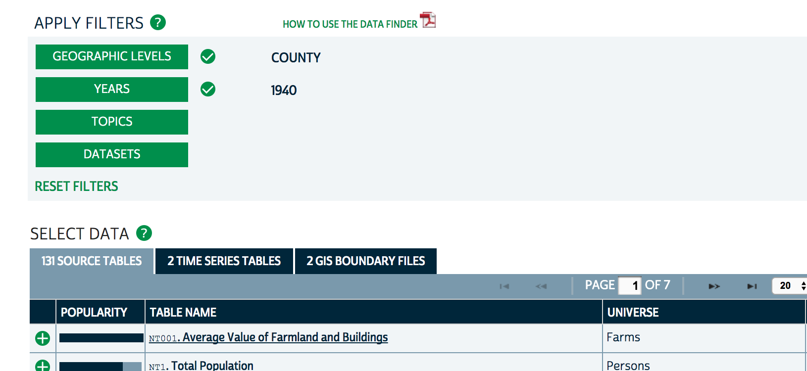
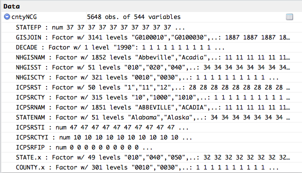
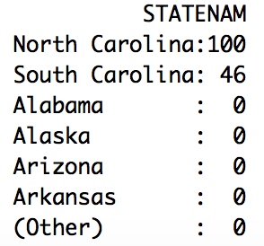
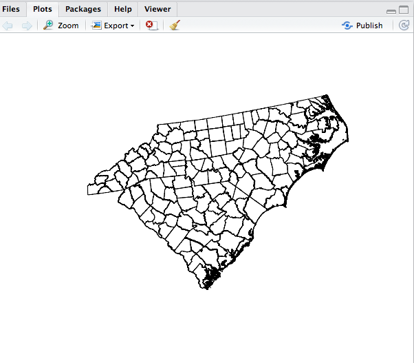
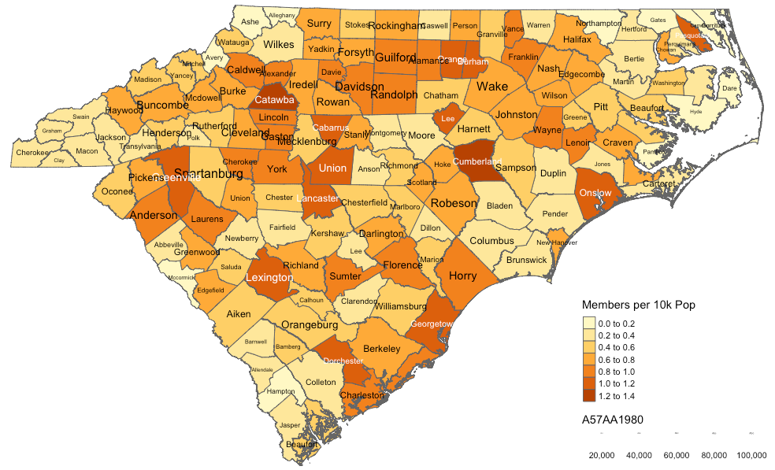
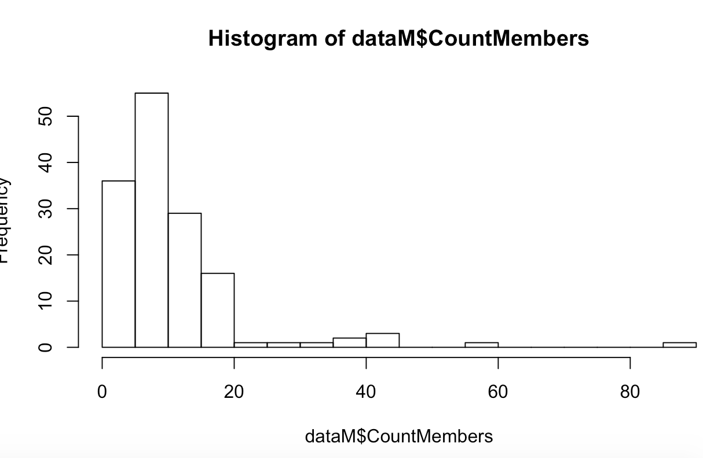
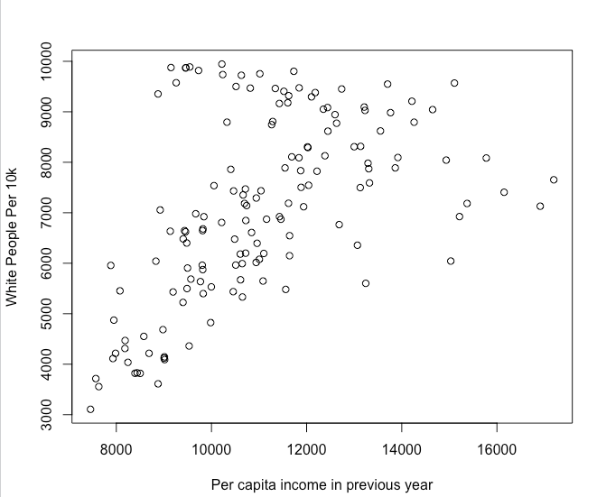
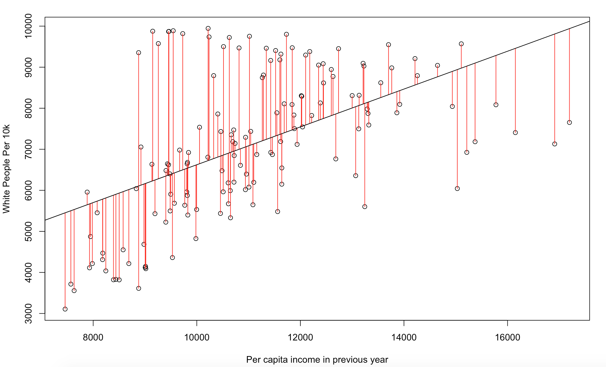
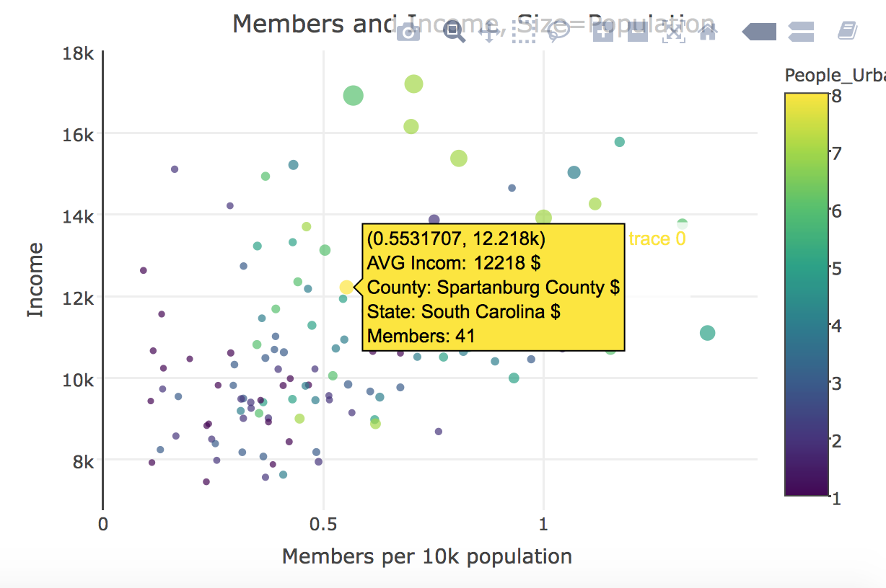

## Pre-requisites

The work for this lesson will be done in R and R Studio, an open source statistical package used by data scientists, statisticians and other researchers. Some background knowledge of the software and statistics will be helpful. For introductions to R, I recommend the [r-basics](http://programminghistorian.org/lessons/r-basics-with-tabular-data) tutorial  and the more comprehensive [Digital History Methods in R](http://lincolnmullen.com/projects/dh-r2/) as a starting points. There are many other services such as this [MOOC](https://www.coursera.org/learn/r-programming) and [DataCamp](https://www.datacamp.com/) that can introduce beginners to R's broader functionality. [UCLA](http://www.ats.ucla.edu/stat/r/default.htm) also has a nice introduction.[^1] While this tutorial will attempt to step through the entire process in R, background understandings will be helpful. The tutorial also assumes users will have some knowledge about the event you are observing which you will use later as a means to test and contest assumptions.

## Introduction
One of the foundations of historical scholarship is its ability explain the complex relationships that influence change in the past. These relationships historians elucidate are often geographic and spatial. Historians, largely due to the nature of the research, frequently use qualitative sources as foundation of improved understandings. But with the prevalence of digital sources, geospatial methodologies have the possibility of providing new insights into a wide range of historical subjects. This tutorial is an introduction to some analytical methodologies and visualization that can be utilized to aid this process. Hopefully, you will be able to utilize these methods to deepen undertakings of historical events, or bring new light to others. These methodologies should also help you integrate digital and graphical data into scholarly presentations.

The foundation of this tutorial is the processing of geospatial data. Broadly, this data is the representation of information based on geographic location. It can provide insights into a broad range of social movements by leveraging survey data and its variability across defined spatial regions such as counties. Using these methods, we assume that there is a level of continuity or homogeneity within the defined regions.[^2] We can leverage these understandings to assess historical events and movements. For example, if a large proportion of members of a particular group come from a group of counties, the characteristics of these counties can provide insight into the nature of that movement.[^3] In some cases, analysis can also reveal hidden realities about social movements or events based on its geographic nature. You can hopefully discover trends that may be surprising or some that we find are not a strong as we would assume.

## Lesson Goals
The goal of this tutorial is provide basic knowledge on how to use geographic data to analyze historical movements, especially movements where we have datasets or lists that are geographic in nature. You will learn how to obtain historical census data in R which will be utilized to look at geographic traits and characteristics of a region. You will then learn how to merge this public data with other historical data such as geographic points or membership lists. The lesson will then move to analysis. In this section, you will learn how to visualize the insights you can gain from this merged data. Here you will learn how to geographically visualize these relationships. We will then discuss some statistical methods and models that can provide further insights.

## Getting Started
This tutorial will assume that you have [set up R and R studio](https://www.youtube.com/watch?v=Ohnk9hcxf9M) or [R studio for Mac](https://www.youtube.com/watch?v=ICGkG7Gg6j0). Once setup, you should open up the program. I recommend creating a new project and setting up a working directory where you will store all of your information. Once setup, you should see something like: 


The first steps in R will be to load the necessary libraries that will allow R to perform the geographic functions used for this type of analysis. In R, you must perform a one time install of the libraries before you can use them. After they are installed, you can simply load the library and their functionality will be available.

To install the packages[^6] necessary type the following into your code area. Then, on each line, hit shift enter(PC) or command enter(Mac) to run the added commands:

    install.packages("ggmap") #spatial visualization
    install.packages("sf") # helps us work with spatial data
    install.packages("tmap") #helps create simple choropleths

After each "Enter," your console will indicate it is downloading and installing the packages.  It will complete with:

     downloaded x.x MB
     The downloaded binary packages are in . . .


You now need to load each of these libraries. I often put a **#** in front of the install commands to disable them as they are only needed one time. Follwing these commands you should use the library commmand to load the newly installed libraries. As before and with all future commands, use either shift enter(PC) or command enter(Mac) to run the added commands:
```
library(ggmap)
library(sf)
library(tmap)
```
## The Data
The analysis in this tutorial is centered around [shapefiles](https://www.esri.com/library/whitepapers/pdfs/shapefile.pdf). Shapefiles are datafiles that represent geographic regions and can also contain characteristics about that region. The U.S. census contains a bevy of information in shapefile format.
	
But, in order to get this information from historic censuses we are going to use the [National Historical Geographic Information System (NHGIS)](https://www.nhgis.org) which is managed by the Minnesota Population Center at the University of Minnesota. NHGIS is a warehouse of historical census data covering the span of U.S. history. In order to use their services, you must first register and create an account. Once completed you can use their [datafinder](https://data2.nhgis.org/main) to select the geographic level, time period, and the data that interests you.

If you are looking nationally prior to 1990, the county-level data is often your best bet as more precise geographic levels had not been standardized. For some regions and cities, however, there are more precise levels and in some cases smaller than zipcodes. For this tutorial, we will use county level data. In general, it is best to use the smallest geographic region possible, but for historical research that often ends up being at the county level. In general, larger population centers have more detailed historical data, but rural areas were not completely covered until the 1990 census. For a more detailed description of the census regions and an interactive map see [NHGIS's discussion](https://www.nhgis.org/user-resources/data-availability#table-data)

NHGIS has tutorials on how to [select data in their system](https://www.nhgis.org/sites/www.nhgis.org/files/using_the_nhgis_data_finder.pdf) but the essence is that you must select the geographic level and years of interest. When selecting, keep in mind the decennial census years and modern census has more information available so it is most likely best to choose the year of the decennial census closest to your historical subject. You can then choose the data available.




You will then be able to download two folders which contain the information you selected. One of these folders will contain the shapefiles that define the geographic regions of interest. The other contains extended census statistics for that geographic region based on your selections. This data will be merged later. But for now, I recommend creating a data directory in your working directory and dropping both folders there.

## Reading the Data
We now need to read in the selected data. We are going to create a variable and read in our data from our shapefile directory to it. Once run, cntyNCG will contain the data and geographic information that we will analyze:
```
cntyNCG <- st_read("./data/County1990/")
```
We should now have a data object loaded with attached data:



If you are only interested in looking at particular states, I recommend filtering the results to speed up processing and data analyisis. To accomplish this use the following commands:
```
cntyNCG = cntyNCG[which(cntyNCG$STATENAM %in% c("North Carolina","South Carolina")),]
```

Following this command, I usually take a look at the distribution of the data using the summary command to ensure I am looking at the newly filtered data:
```
summary(cntyNCG)
```

This will return a bunch of data but most importantly it is showing that I have data only for the states I am filtering on:




Optionally, you can also plot the results to view a map of the shapefiles that you have downloaded. This could take some time, especially if you are not filtering the data. As above, this helps confirm that you are looking at the right geographic areas as only the filtered areas should be drawn:
```
plot(cntyNCG$geometry,axes=TRUE)
```



## Merging Census Data
The next step is to begin merging these shapefiles with data table in the downloaded data directory. In this tutorial, I am going to go over a series of merge options, depending on the format of the associated historical data that you want to analyze. But before we get these external merges, we must first merge the NHGIS table data with their own shapefiles.

Lets read in the NHGIS data and merge it on the common field:
```
nhtb = read.csv("./data/County1990_Data/nhgis0027_ts_nominal_county.csv", as.is=TRUE)
cntyNCG <- merge(cntyNCG,nhtb,by.x="GISJOIN", by.y="GISJOIN")
```
The number of variables in cntyNCG should now increase as all of table data data is brought into this one object. We now have one large data frame that has all of the geographic and statistical data we downloaded. We could stop and analyze this data as it undoubtedly contains many insights but it is only the raw census data.

## Merging External Data
But in many cases we are interested in a particular historical event or phenomenon. This is usually represented by an external set of data that will contain geographic data. For example, you may have a list of members that belonged to an organization; or a list of events that happened during a particular time period; or a list of places an individual choose to visit. This type of data will come in two basic formats. The first is geocodable information such as locations, address, or incident locations. The second will be a table that lists the same information alongside the county(or geographic region) where it occurred. We can handle either.

## Geocoding
In the first case we have raw addresses which will necessitate some additional steps. The address will need be transformed into geographical points in a process called [geocoding](https://en.wikipedia.org/wiki/Geocoding). R can do some of this work but if you have a large number of addresses, you will need to use an external service because the free services R uses (such as google) will cap how many address you can geocode in a day. One popular outside service is hosted by [Texas A&M Geocoding Services](http://geoservices.tamu.edu/Services/Geocode/) and can handle large batches at a reasonable price. In the end, our address will be transformed into a list of latitudes and longitudes. This is the data R can now work with now.

If you have less than 2,500 addresses this can be handled in R using Google's geocoder. In R, you must first gather the address from whatever dataset you have. And then transform it:
```
addresses = data$Address
MemberCoords=geocode(addresses)
```
We now have a dataframe of geographic coordinates. But we still need to merge it with our shape files so we can analyze it in relation to the census data we have downloaded. First, we either get the externally geocoded data or the newly geocoded data.
We also should remove the records with empty data that that represents addresses that could not be geocoded. Then we turn it into a SpatialDataFrame that can be merged[^7]. We can see the process below:
```
z = read.csv("./data/GeocodedAddresses.csv", as.is=TRUE)
#or
z= MemberCoords

#Now remove empty data or failed geocoding rows
z = z[!is.na(z$Latitude) & !is.na(z$Longitude),]
#Now create the dataframe with geographic information for the merge
pts <- st_as_sf(z, coords= c("Longitude","Latitude"),crs = 4326, agr = "constant")
```
Before we do the actual merge, we should ensure both objects are using the same coordinate systems with or census and external data otherwise the points and that counties will not match up throwing everything off. To do that we transform our census data to our current system.
```
cntyNCG <- st_transform(cntyNCG, st_crs(pts))
```
Then I like to glimpse the distribution of the point data within the census. We do this for a couple of reasons. First to verify that the merge will function correctly. Secondly, to begin to look at the data distribution. We should see a list of numbers where each list represents the points that intersected with a particular county.
```
st_intersects(cntyNCG,pts) # show which counties each point falls into

```
We can also map the data points on top of our map for a quick visual of our data:
```
plot(cntyNCG$geometry,axes=TRUE)
plot(pts[which(pts$State %in% c("NC","SC")),]$geometry,col = "green", pch=20,cex=.5, axes=TRUE,add=TRUE)
```
Now we do the merge. It is a bit diffrent here as we are going to create a new field that respresents the number of 'hits' within a county. In essecence, we are transforming our lists into count data so we can visualize and analyize:
```
cntyNCG$CountMembers <-sapply(st_intersects(cntyNCG,pts), function(z) if (length(z)==0) NA_integer_ else length(z))
```
Now we have a large DataFrame called cntyNCG which has our count data and our census data by county. CountMembers now contains the count of members for their respecive counties. But we may also want to merge data that is not a geographic point but rather a count of events/members and associated counties. This data should come from roughly the same timeframe as the spatial data for accuracy. To do this merge we need to load the list:

```
relig= read.csv("./data/Religion/Churches.csv", as.is=TRUE)  
```
Depending on the state of the data you may need to do some data transformations in order to merge it back with the DataFrame. For complex transformations, see tutorials in R on working with data such as [Data Wrangling and Management in R tutorial](http://programminghistorian.github.io/ph-submissions/lessons/data_wrangling_and_management_in_R) [data transforms](http://r4ds.had.co.nz/transform.html). In essence, you need to have a common field in both datasets to merge upon. Often this is a geographic id for the county and state represented by GEOID. It could also be the unique FIPS Code given by the US Census. Below I am using state and county GEOID:
```
relig$STATEFP <- relig$STATE
relig$COUNTYFP <-relig$COUNTY
cntyNCG$STATEFP <- as.numeric(as.character(cntyNCG$STATEFP))
cntyNCG$COUNTYFP <- as.numeric(as.character(cntyNCG$COUNTYFP))
```
We then can merge the data with the spatial frame, merging where state and counties match ids:
```
cntyNCG <- merge(cntyNCG,relig,by=c("STATEFP","COUNTYFP"))
```
This will bring in all additional fields into our SpatialDataFrame.

Now we have a large spatialDataFrame called cntyNCG which has our geocoded count data, our external count data and our census data by county. It is now time to begin to look at the data distribution and assess if everything appears correct and is in a format that will allow for some visualization and data analysis. We have some inherent complexity to our data because it is considered "count data." As such, we should be cognizant that our data is not measuring individuals directly but rather relationships between counties. We are attempting to discover if counties with certain traits lead to higher membership in our datasets. These realities can help us gather some assumptions on the individuals in these regions.
## Visualizing
Because we are analyzing geospatial data, it is often best to begin with geographic visuals. There are many options here, but I find it easiest to start with the qtm function from the TMAP library which creates [choropleths](https://en.wikipedia.org/wiki/Choropleth_map) map simply. We could also use [GGPlot2](http://strimas.com/r/tidy-sf/) which which should be instaled using the development version. First on our list should be membership numbers relative to population(relative membership distribution). One of the most commonly used and clearist ways to display this information is by number of members per 10,000 people.


Now, we are going to prepare the map. In the downloaded census data folders, there is a codebook that will reveal what fields represent what data. After looking through the codeboook, I discovered AV0AA1990 is the total Census population as of 1990. We will then do the math to create a relative population variable. We do this because we have to ensure we are taking into account the variability of populations within the census regions we are analyzing otherwise we will get misleading visualization in densely populated counties that represent general population trends rather than variable relationships. If we did not take this step, we would undoubtedly see a map that highlights urban areas rather than areas where membership data is strongest:
```
cntyNCG$RelativeTotal= ((cntyNCG$AV0AA1990/10000)/cntyNCG$CountMembers )
```

Now we will create the map. TMAP allows for the quick creation of thematic maps. We can also vary text size based on another census variable. Here I am using the count of people as defined as living in rural areas (A57AA1980) as defined by the US census, making the text larger in more rural counties:

```
qtm(shp = cntyNCG, fill = "RelativeTotal",text="NHGISNAM",text.size="A57AA1980")
```




Feel free to experiment with the choropleth. In particular, try switching out the text.size variable to see if you can discover patterns. For example, can you detect any trends between choropleth colors and text size.

You can also look and the non-normalized distribution which shows the raw distribution of members or incidents:
```
qtm(shp = cntyNCG, fill = "CountMembers",text="NHGISNAM",text.size="A57AA1980")
```
## Visualizing Data Relationships
While choropleths are an extremely helpful way to visualize the geospatial data, there are other methods that help visualize the data. One helpful method is the scatterplot which provides a visual means to show relationships between two variables. In particular, it is useful to assess if there are correlations between our event data and other characteristics as defined by the census data. While [correlations do not alone prove causality](http://www.nature.com/nmeth/journal/v12/n10/full/nmeth.3587.html), they do provide basic insight. When doing these comparisons, we have to again ensure we are taking into account the variability of populations within the census regions we are analyzing otherwise we will get misleading correlation in densely populated counties. To do this we need to convert any population number into numbers per 10,000 people.

If, for example, we wanted to use B18AA1990 which is the persons-white variable we would convert it to relative number:
```
WhitePer10K <- ((dataM$B18AA1990/dataM$TOTPOP)*10000)
```

Other total data should take regional size into account as well. For example, if we wanted to look at churches of a particular denomination, we would need to convert that as well because larger counties would inherently be more likely to have churches of any particular denomination, presenting misleading correlations. To look at AOG.C which is Assemblies of God churches we would:
```
AOGChurchesPer10K <- ((dataM$AOG.C/dataM$CHTOTAL)*10000)
```

Then I recommend taking a look a the distribution of the count data:
```
hist(dataM$CountMembers,breaks = 15)
```




OK, there are a significant number of low values which is typical of this type of information and some counties that are much higher than other.[^4]

Then set up the variables to try to take a look at some of the influencers of this distribution:
```
MembersPer10K <- ((dataM$CountMembers/dataM$TOTPOP)*10000)
AOGChurchesPer10K <- ((dataM$AOG.C/dataM$CHTOTAL)*10000)
```
Now let’s plot the data:
```
plot(MembersPer10K,ChurchesPer10K)
```
Because we are dealing with count data, it is also helpful to perform a logarithmic transformation on a variable of the scatter plot to inspect for possible non-linear relationships. We add 1 to the values[^5] because log(0) is undefined. You could use .5 as some people do as well. Below we will anylize if there is a relationship between membership numbers and the count of churches in the counties observed.
```
plot(MembersPer10K, log(ChurchesPer10K+1))
```
Most often, we are going to be comparing data points to our historical data, but we can also inspect for other relationships. For example, here is scatterplot of race and per capita income in linear form:
```
plot(WhitePer10K,dataM$BD5AA1990)
```
Below we see the results of the above code. We see what is described as a positive correlation. As the percentage of white people increases, the per-capita income rises accordingly. We can measure that statistically, but we can also see it visually.




We can see this more precisely by adding a line of best fit to the plot which represents an estimated values based on the data presented. I also added red lines representing the distance from this line known as residuals. In essence, this showing us that we see a correlation and it can be modeled with some accuracy.

Here we see it:



You can also create more complex scatterplots that can provide further insights. Plot.ly offers interactive scatter plots that can be customized and shared. Here is an example that looks at the relationship between income and membership but also adds urban status to the visual using color. I am also adjusting point size based on population so I can take a look at more populated areas alongside the other data:





```
library(plotly)

var = dataM$A57AA1990
bins = unique(quantile(var, seq(0,1,length.out=8)))
interv = findInterval(var, bins)
dataM$People_Urban <-interv

p <- plot_ly(
  dataM, x = ~((AV0AA1990/10000)/CountMembers), y = ~BD5AA1990,
  # Hover text:
  text = ~paste("AVG Incom: ",BD5AA1990 , '$<br>County:', COUNTY.y,'$<br>State:', STATENAM,'$<br>Members:', CountMembers), size = ~AV0AA1990, color = ~People_Urban,
  textfont = list(color = '#000000', size = 16)) %>%
  layout(title = 'Members and Income, Size=Population',
         xaxis = list(title = 'Members per 10k population'),
         yaxis = list(title = 'Income')) 

p
```
## Other Models and Visualizations
There are many other models and visualizations available that can bring insight but they also add some complexity which demand further statistical understandings. While statistical modeling usually focuses on a particular model's predictive insight, well-fit models also provide insight into the data they represent. In particular, the Poisson regression is frequently used to create [models of count data](http://www.theanalysisfactor.com/regression-models-for-count-data/) which is how population data is often represented.[Geographically Weighted Regressions](https://rstudio-pubs-static.s3.amazonaws.com/44975_0342ec49f925426fa16ebcdc28210118.html) also have particular advantages with this type of data. But assessing fit has some complexity. [Decision trees](hhttps://www.analyticsvidhya.com/blog/2016/04/complete-tutorial-tree-based-modeling-scratch-in-python/) could also be useful for historical data because they give an understandable graphical representation of the the leading factors that caused inclusion in a group or list. Principal component analysis, [correspondence analysis](https://github.com/programminghistorian/ph-submissions/blob/gh-pages/lessons/correspondence-analysis-in-R.md) and other clustering methods can also be helpful, especially when there is limited knowledge or insight into the event being analyzed yet there is an abundance of data associated with the event. I recommend background reading or discussions with a data scientist or statistician when exploring some of these modeling options as understanding the configuration and parameters of the individual models is essential to ensuring the results are trustworthy and significant.


[^1]: For an overview of R as it relates to the humanities with a chapter geospatial data also see Arnold Taylor and Lauren Tilton, Humanities Data in R (Cham: Springer, 2015). They also have a geospatial chapter that uses the sp library.

[^2]: For a discussion on the benefits and drawbacks on this methodology and its assumptions see, [Spatializing health research](https://www.ncbi.nlm.nih.gov/pmc/articles/PMC3732658/). Some states like Kentucky have a larger number of counties (120) which often encompass entire cities which often leads to more homogeneity within those regions. In contrast, a state like Massachusetts has only 14 counties which can lead to more variability with the county geographies leading to more questionable results in some cases.

[^3]: This is often leveraged in the field of public health. See for example, [Spatial Analysis and Correlates of County-Level Diabetes Prevalence](https://www.cdc.gov/pcd/issues/2015/14_0404.htm).

[^4]: Count data typically has large numbers of zero values which can add some complexity that will not be covered here. There are more complex ways to minimize this using more complex regression models. See, for example [Regression Models with Count Data](https://stats.idre.ucla.edu/stata/seminars/regression-models-with-count-data/).

[^5]: There are different strategies to dealing with this type of data. See for example, [The Excess-zero Problem in Soil Animal Count Data](http://www.sciencedirect.com/science/article/pii/S0031405608000073) or [Data Transformations](http://www.biostathandbook.com/transformation.html).

[^6] For details on ggmap and and integration with Google Maps or other maps services see the [ggmap overview](http://stat405.had.co.nz/ggmap.pdf). For another broader discussions on google map making that utilizes a few of the libraries in this tutorial see [R and Google Map Making](https://rpubs.com/nickbearman/r-google-map-making). For a discussion of the sf library and it relationship to sp see [Simple Features for R](https://cran.r-project.org/web/packages/sf/vignettes/sf1.html). While sp has been the library spatial analysis library of choice, it is being superseded by sf.

[^7] We are setting Coordinate Reference System(CRS) to EPSG 4326 which is the most common mapping system used int the U.S. It is used by Google  which is the origins of our data. EPSG 3857 is also used by google. For more on CRS see [Intro to Coordinate Refrence Systems & Spatial Projections](http://www.datacarpentry.org/r-spatial-data-management-intro/R/intro-to-coordinate-reference-systems). Also see [coordinate systems reference in R](https://www.nceas.ucsb.edu/~frazier/RSpatialGuides/OverviewCoordinateReferenceSystems.pdf).
